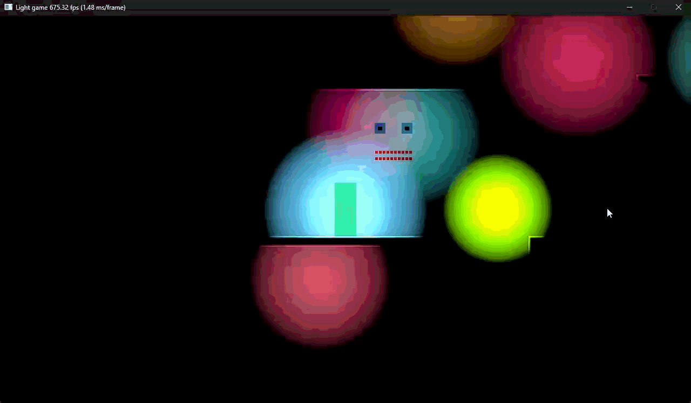

<p align="center">

</p>

# Light Game (2D Bevy Engine with Custom Vulkan Pipeline)

## Overview
A 2D game project built from scratch in Rust using the Bevy ECS and a custom Vulkan rendering pipeline. It features a custom vulkan backend, bespoke 2D shadow calculations, shader color blending, and a custom ECS-integrated physics and rendering system.

## Technical Highlights & Architecture

* **Custom Vulkan Backend:** Replaces Bevy's default renderer with a [custom fork of bevy_vulkano](https://github.com/mathijs28498/bevy_vulkano.git), injecting raw Vulkan graphics pipelines directly into Bevy's ECS.
* **Dynamic 2D Shadows:** Lights are drawn using a dynamic polygon technique. The CPU loops over environment corners and performs ray/AABB collision checks to calculate the exact un-occluded polygon for each light in real-time.
* **ECS Rendering Integration:** Rendering components, buffers, and pipelines are deeply integrated into Bevy's Entity Component System. Vertex and index buffers are updated dynamically and passed to the GPU via Bevy queries.
* **Custom Physics & Collision:** Simple physics and collision detection are handled manually, including raycasting for the light geometry generation and velocity-based movement.
* **Memory Management:** Leverages `bytemuck` for safe casting of Rust structs into byte slices, enabling zero-copy transfers of vertex, index, and uniform data (via push constants) directly to Vulkan GPU buffers.

## Build Instructions

Fiji is built using standard Rust tooling (`cargo`). 

### Prerequisites
* [Rust & Cargo](https://rustup.rs/)
* Vulkan SDK (ensure your drivers support Vulkan 1.2+)

### Build & Run
1. Clone the repository:
   ```bash
   git clone https://github.com/mathijs28498/light-game/
   ```
2. Navigate to the project directory.
3. Build & Run:
   ```bash
   cargo run --release
   ```

## Controls

| Key               | Action                              |
| :---------------- | :---------------------------------- |
| **A, D**          | Move Left, Right                    |
| **Space**         | Jump                                |
| **R**             | Reset Player Position               |
| **Left Click**    | Shoot Lights                        |
| **E**             | Randomly Change Light Position      |
| **W**             | Remove Random Lights                |

## License
This project is licensed under the [MIT License](LICENSE).
